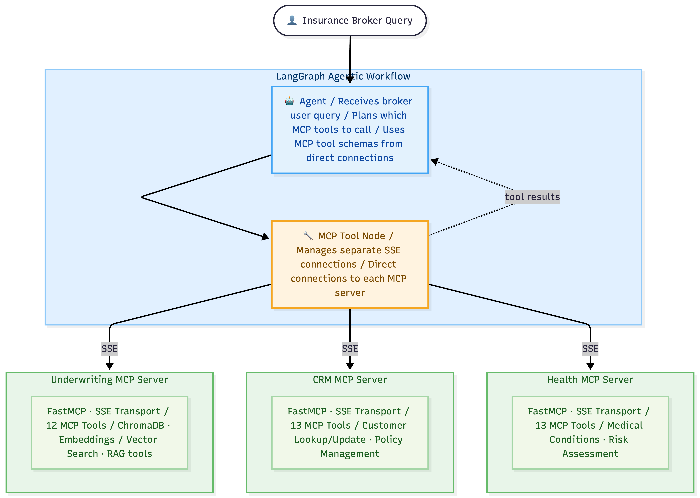
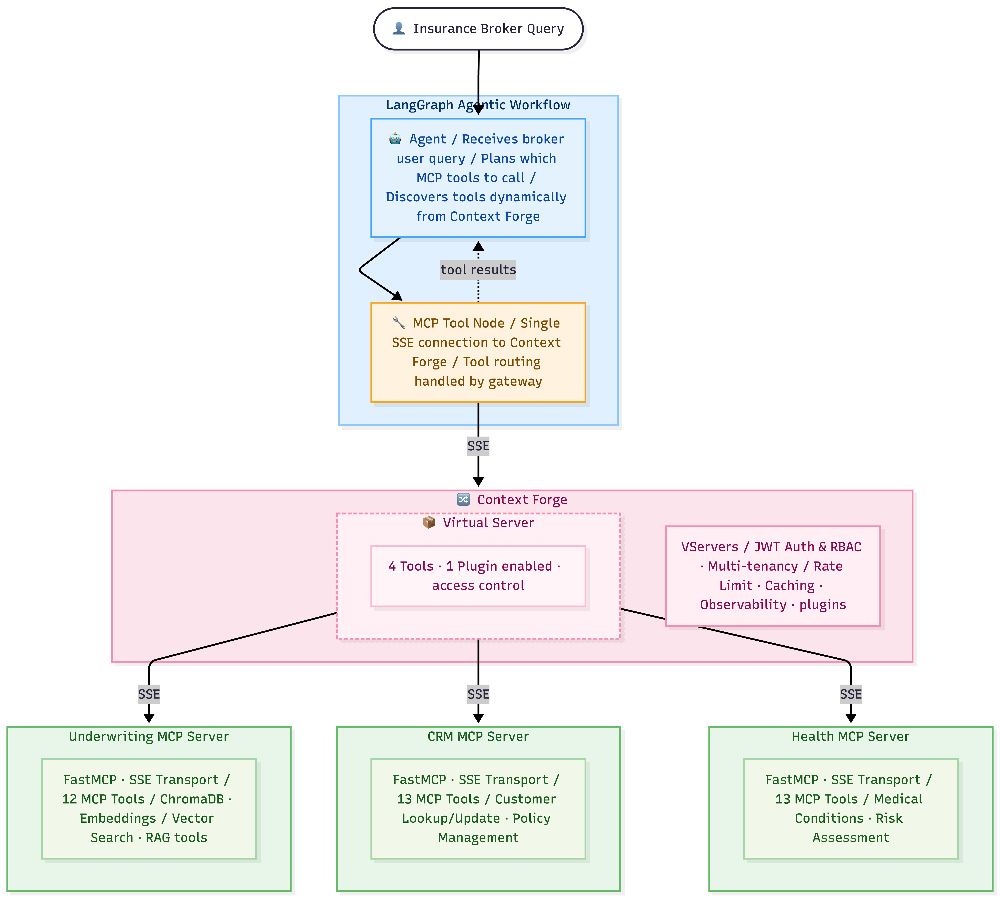
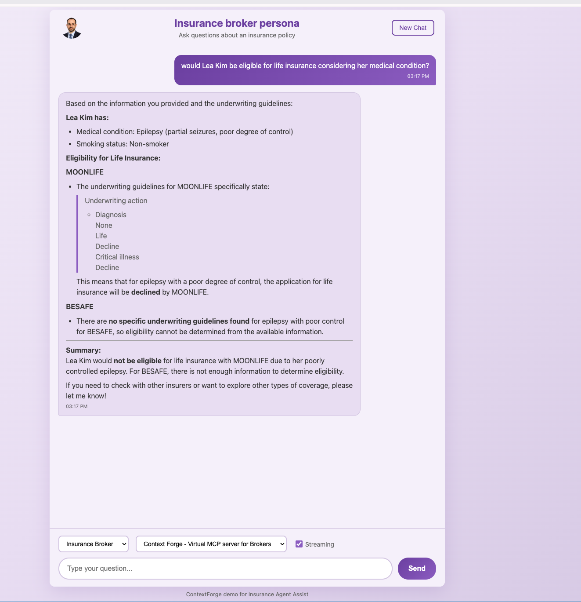
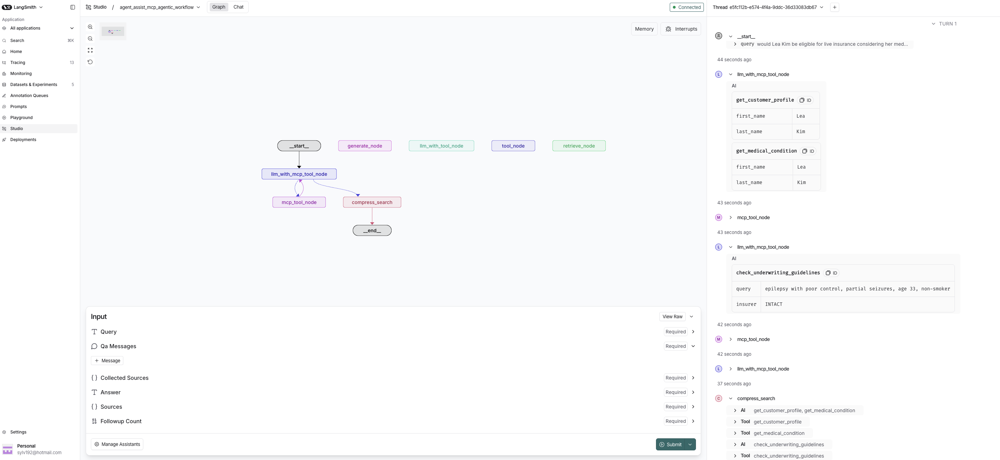

# ContextForge Demo with Insurance Broker Assist

## Why ContextForge MCP Gateway?

ContextForge is an open-source MCP gateway that gives your agents better trajectories, enforces role-based access control, and provides centralized pre/post hook plugins - so your organization can govern AI-accessible resources consistently, at scale.

> **ContextForge MCP Gateway is an intelligent orchestration layer between your AI agents and your MCP servers - giving the right tools, to the right users, at the right time.**

---

## The Challenge: MCP's Double-Edged Power

MCP standardized how AI agents communicate with tools and data sources, significantly reducing the need for custom integrations. Before MCP, every AI application required a bespoke connection to every data source and tool - an exponential integration burden. With MCP, applications implement one protocol to access any MCP-compliant tool, collapsing a many-to-many problem into a clean hub-and-spoke model.

But that standardization creates a new challenge: **the explosion of MCP servers**.

With the huge amount of community-built MCP servers now available, enterprises face critical problems:

- **Tool sprawl degrades agent performance** - Exposing an agent to 50+ tools overwhelms the LLM's context window, leading to longer, less focused reasoning trajectories and incorrect tool selection.
- **No native security or governance** - MCP has no built-in mechanism to control who can access what, or to prevent agents from invoking destructive operations like "delete Kubernetes cluster" - or silently running up costs.
- **Integration complexity at scale** - Every agent framework (Claude, Copilot, LangChain, AutoGen) can now reach thousands of MCP servers, but without a control plane to manage permissions, rate limits, and audit trails, that openness becomes a liability.

---

## Context Forge: 3 Key Benefits

### 1. Improved Agent Performance
By reducing the available tool space to only those relevant for the current task, Context Forge improves trajectory precision. The agent is no longer "distracted" by irrelevant tools; it converges faster toward the right answer.

### 2. Granular Access Control
Context Forge lets you define, per user or per role, which tools and resources are accessible. In a RAG solution, for example, a junior broker won't see the same data as a senior manager. All of this is dynamic and configurable.

### 3. Plugins & Guardrails
Context Forge includes a configurable plugin and guardrails system that intercepts tool calls and responses at the gateway level, protecting against drift, misuse, and out-of-scope calls. Plugins such as the built-in PII filter automatically mask sensitive personal data in tool outputs before they reach the agent, providing a centralized, enterprise-grade enforcement point for data compliance.

---

## Demo Scenario

This demo uses an **insurance use case** to illustrate two concrete problems Context Forge solves:

1. **Agent performance** - an agent given unrestricted tool access produces longer, less focused trajectories than one scoped to only the tools it needs.
2. **Access control** - two roles (Insurance Brokers and Insurance Analysts) exist in the same organisation but should not have access to the same tools. Context Forge enforces this at the gateway level without any changes to agent code.

---

### Scenario 1  Without Context Forge

The agent has unrestricted access to all available MCP servers. When processing a request, it:

- Hesitates between irrelevant tools
- Queries resources that aren't needed for the task
- Produces an imprecise or incomplete response
- May access sensitive data outside the relevant scope

**Agent trajectory**  long, non-optimal
**Result**  approximate response, potentially incorrect
**Risk**  exposure to sensitive data irrelevant to the case

---

### Scenario 2  With Context Forge - Performance & Role-Based Access Control

Context Forge is introduced into the architecture. Two teams are provisioned, each receiving a distinct virtual MCP server:

| Team | Virtual Server | Tools Exposed |
|------|---------------|---------------|
| **Insurance Brokers** | `broker_gateway` | `crm-get-client-id`, `crm-fetch-client-profile`, `underwriting-check-underwriting-guidelines`, `health-get-medical-condition` |
| **Insurance Analysts** | `analysts_gateway` | `crm-get-client-id`, `crm-fetch-client-profile`, `crm-update-address` |

Brokers get full access to the insurance workflow (CRM + underwriting + health data). Analysts are restricted to CRM read access and address updates - they cannot query underwriting guidelines or health records.

**Step 1  Setup Context Forge**
Run `make setup-context-forge` to create teams, register upstream MCP servers, and provision team-scoped virtual servers - each exposing only the tools relevant to that role.

**Step 2  Review in the Admin UI**
Visualize, modify, and audit each team's authorized resources in real time through the Context Forge interface - no agent code changes required.

**Step 3  Integrate Access to the Virtual Server in the Agent App**
Point the agent to its team's Context Forge virtual server URL. The agent now sees only the tools authorized for that role, with no other changes to application logic.

**Step 4  Plugin: Centralized PII Masking**
Activate a PII filter plugin at the gateway level. Sensitive personal data is automatically masked in tool outputs before reaching the agent - one configuration, enforced uniformly across all tools and agents.

**Result:**
The same scenario with a different outcome. Each role's agent produces a more precise, targeted response within its defined scope. The broker's trajectory is efficient and complete; the analyst's agent physically cannot call health or underwriting tools - not because of application logic, but because those tools don't exist in their virtual server.

---

## Summary

| Dimension | Context Forge Benefit |
|---|---|
| **Agent performance** | Shorter trajectories, more precise responses |
| **Security & compliance** | Granular access control per team / role - different tool sets per virtual server |
| **Data protection** | Centralized PII masking enforced at the gateway, across all tools and agents |
| **Governance** | Real-time audit and permission visualization |
| **Maintainability** | Zero changes to agent logic |
| **Scalability** | Compatible with any existing MCP server |

---

## Architecture

```
┌─────────────────────────────────────────────────────────────────┐
│                        Frontend (Chat UI)                       │
│              Workflow selector · Streaming · Markdown           │
└──────────────────────────┬──────────────────────────────────────┘
                           │
┌──────────────────────────▼──────────────────────────────────────┐
│                    FastAPI Backend (LangGraph)                  │
│                                                                 │
│  ┌──────────────────┐ ┌──────────────────┐ ┌─────────────────┐  │
│  │  Self-Serve QA   │ │  Agent Assist QA │ │ Agent Assist    │  │
│  │  Workflow        │ │  Workflow        │ │ Agentic Workflow │ │
│  └──────────────────┘ └──────────────────┘ └────────┬────────┘  │
└─────────────────────────────────────────────────────┼────────── ┘
                                                      │
                    ┌─────────────────────────────────▼──────┐
                    │        MCP Context Forge Gateway       │
                    │     Access control · Guardrails        │
                    │     Audit · Admin UI                   │
                    └──┬─────────────────────┬──────────────┘
                       │                     │
          ┌────────────▼──────────┐  ┌───────▼────────────────┐
          │   broker_gateway      │  │   analysts_gateway     │
          │   (Insurance Brokers) │  │   (Insurance Analysts) │
          │   4 tools             │  │   3 tools (CRM only)   │
          └────────────┬──────────┘  └───────┬────────────────┘
                       │                     │
         ┌─────────────┼─────────────────────┤
         │             │                     │
┌────────▼────┐  ┌─────▼─────────┐  ┌───────▼─────┐
│ Underwriting│  │   CRM MCP     │  │ Health MCP  │
│ MCP Server  │  │   Server      │  │ Server      │
│ (port 8007) │  │  (port 8008)  │  │ (port 8009) │
└─────────────┘  └───────────────┘  └─────────────┘
```

### Connection Modes

#### Direct MCP Server Connection (Without Context Forge)

The agent connects directly to all MCP servers simultaneously and has unrestricted access to every available tool. With no scoping in place, it must reason over the full tool space, leading to longer, less focused trajectories and potential exposure to out-of-scope data.



#### With Context Forge Gateway

The agent connects exclusively through the Context Forge virtual server. The gateway enforces role-based access control, exposes only the tools relevant to the current user's task, and applies guardrails before any tool call reaches the underlying MCP servers.



---

### MCP Servers

The demo includes three independent MCP servers, each exposing domain-specific tools via SSE transport:

| Server | Port | Tools | Purpose |
|--------|------|-------|---------|
| **Underwriting** | 8007 | `check_underwriting_guidelines` | Searches vector DB for insurer-specific underwriting rules (BESAFE, MOONLIFE) |
| **CRM** | 8008 | `get_customer_profile`, `update_address` | Retrieves and updates customer records |
| **Health** | 8009 | `get_medical_condition` | Retrieves customer medical conditions and smoking status |

> **Note:** Document ingestion into the vector store runs automatically when the Underwriting MCP server starts. The two underwriting manuals (`field-underwriting-manual-984e.pdf` for BESAFE and `iaa.pdf` for MOONLIFE) are ingested into Chroma before the server begins accepting requests.

**Without Context Forge**, the agent connects to all servers and has access to every tool, leading to unfocused, inefficient trajectories. **With Context Forge**, two team-scoped virtual servers are created: the broker's gateway exposes 4 tools relevant to the full insurance workflow, and the analysts' gateway exposes 3 CRM-only tools - enforcing role-based access at the gateway level.

### Workflows

The application provides three LangGraph workflows selectable from the UI:

1. **Self-Serve QA**  Customer-facing assistant that retrieves underwriting guidelines from a vector store and answers in simple, non-technical language. Supports multi-turn follow-up conversations.

2. **Agent Assist QA**  Same RAG pipeline but tailored for insurance brokers, providing technical underwriting details with citations.

3. **Agent Assist Agentic**  Fully agentic ReAct workflow where the LLM autonomously decides which tools to call. It can look up a customer profile, check their medical conditions, and query underwriting guidelines, all through MCP tools. This workflow supports two configurations that demonstrate the impact of Context Forge:

   - **Direct access to MCP** *(Scenario 1  without Context Forge)*: The agent connects to all three MCP servers simultaneously and has access to every available tool. With no scoping in place, it must reason over the full tool space, leading to longer, less focused trajectories and potential exposure to out-of-scope data.

   - **With Context Forge** *(Scenario 2  with Context Forge)*: The agent connects exclusively through a Context Forge virtual server scoped to the user's team. The **broker_gateway** exposes 4 tools (`crm-get-client-id`, `crm-fetch-client-profile`, `underwriting-check-underwriting-guidelines`, `health-get-medical-condition`) for insurance brokers, while the **analysts_gateway** exposes only 3 CRM tools (`crm-get-client-id`, `crm-fetch-client-profile`, `crm-update-address`) for analysts - with no access to health or underwriting data. The result is a shorter, more precise trajectory per role, with access control enforced at the gateway level.

---

## UI Screenshots



**Insurance Broker : `broker_gateway`**
The Agent Assist Agentic workflow processes the query *"Would Lea Kim be eligible for life insurance considering her medical condition?"*. The broker's virtual server exposes the full insurance tool set, so the agent autonomously chains three MCP calls: it first retrieves Lea Kim's customer profile from the CRM, then fetches her medical conditions from the Health server, and finally checks MOONLIFE's underwriting guidelines using the carrier and condition derived from the previous calls - producing a precise eligibility assessment in a short, focused trajectory.

**Insurance Analyst : `analysts_gateway`**
The analyst's virtual server is scoped to CRM tools. The query *"Update Lea Kim's address to 1, Place Ville-Marie, Apt 0001, Montréal, Québec, H3B 2C1"* will succeeed and trigger targeted CRM updates. This permissions ared enforced with role-based access at the gateway level without any change to the agent code.

---

## Getting Started

### 1. Setup - Clone the repo and build images

**Prerequisites**

- [Docker](https://docs.docker.com/get-docker/) and Docker Compose
- `make`
- Access to an LLM provider (OpenAI or IBM WatsonX)

**Clone the repository**

```bash
git clone <repo-url>
cd context-forge-demo
```

**Configure environment**

```bash
cp .env.example .env
# Edit .env with your API keys (WATSONX_APIKEY, WATSONX_PROJECT_ID, etc.)
```

At minimum you need `WATSONX_APIKEY` and `WATSONX_PROJECT_ID`. See `.env.example` for all available options (MCP server ports, authentication, LangFuse, etc.).

**Build the container images**

```bash
make build-mcp-server        # builds the MCP server image (includes PDF ingestion)
make build-context-forge-plugin
make build-base && make build-agent-assist
```

---

### 2. Run locally with Docker Compose

> For a complete step-by-step walkthrough, see the [Setup Guide](SETUP.md).

1. **Start the MCP servers** - `make run-mcp-server`
2. **Start Context Forge infrastructure** (Redis + gateway) - `make run-infra`
3. **Start the Agent Assist application** - `make run-agent-assist` → available at **http://localhost:8002**
4. **Configure Context Forge** - log in at **http://localhost:4444**, generate a token, then run `make setup-context-forge`
5. **Update `.env`** with the virtual server IDs and team-scoped tokens printed by the setup script
6. **Restart the application** - `make run-agent-assist`

```bash
make stop-containers   # to stop all containers
```

---

### 3. Deploy to IBM watsonx Orchestrate

> For a complete setup guide, see [wxo-project/SETUP_WXO.md](wxo-project/SETUP_WXO.md).

---

### 4. Deploy to IBM Cloud (Code Engine)

> For a complete deployment guide using Terraform, see the [Deploy Guide](deploy/terraform/DEPLOY.md).

The deploy guide covers:
- Pushing images to IBM Container Registry
- Deploying MCP servers, the Context Forge gateway, and the Agent Assist app via Terraform
- Running the setup job and configuring team tokens
- Fetching application logs with `deploy/logs.sh`

---

### Testing MCP Servers with the MCP Inspector

You can use the [MCP Inspector](https://github.com/modelcontextprotocol/inspector) to test individual MCP servers interactively:

```bash
npx @modelcontextprotocol/inspector <command>
```

### Running with LangGraph Platform

You can also run and debug the workflows using the [LangGraph Development Server](https://langchain-ai.github.io/langgraph/concepts/langgraph_platform/), which provides a visual studio UI for inspecting graph execution, state, and tool calls.

```bash
langgraph dev
```

This starts the LangGraph development server locally, reading the graph definitions from `langgraph.json`. Open the LangGraph Studio UI to select a workflow, submit a query, and visually trace each node execution, including which MCP tools were called and their responses.



---

## Learn More

- [MCP Context Forge](https://github.com/IBM/mcp-context-forge)  The unified MCP gateway powering this demo
- [Model Context Protocol](https://modelcontextprotocol.io/)  The open protocol for AI tool integration

---

## Note on Demo UI Authentication

The chat UI in this demo is intended for **demonstration purposes only**. Context Forge credentials are passed directly to the frontend via `window.BACKEND_PASSWORD` in the `serve_frontend` function, making them available to the browser for API calls to the Context Forge gateway.

This approach is intentional for demo convenience on resource access control but is **for demo purposes onlu**. OAuth-based authentication will be introduced in the next release.
