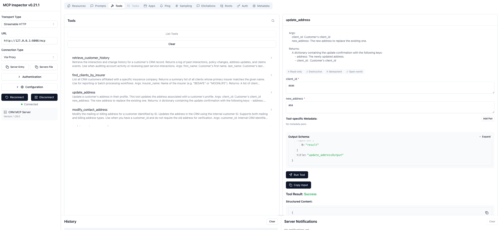
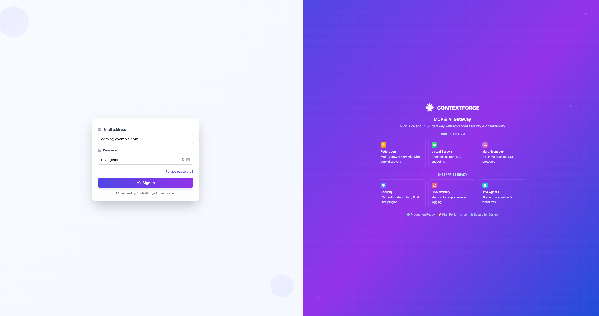
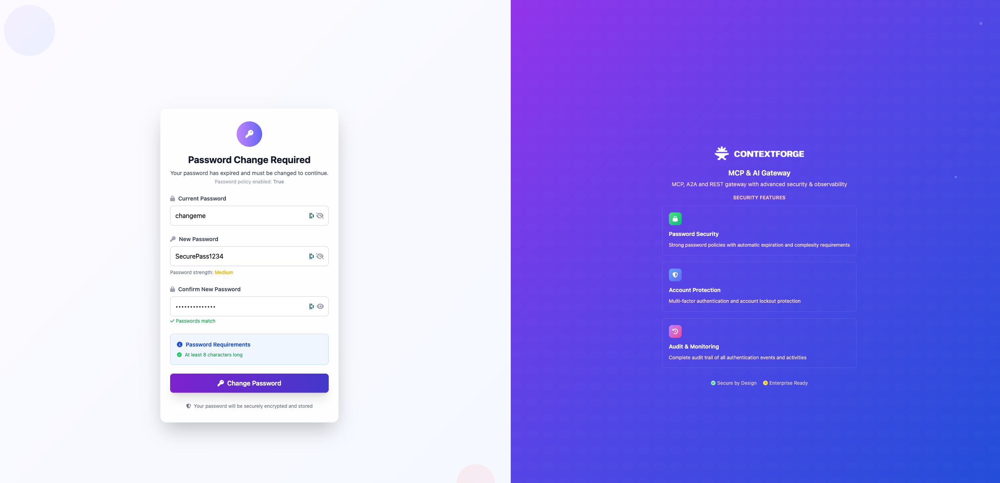
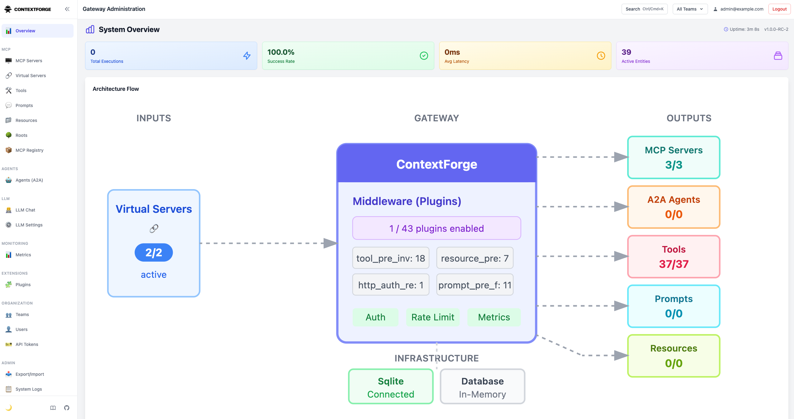
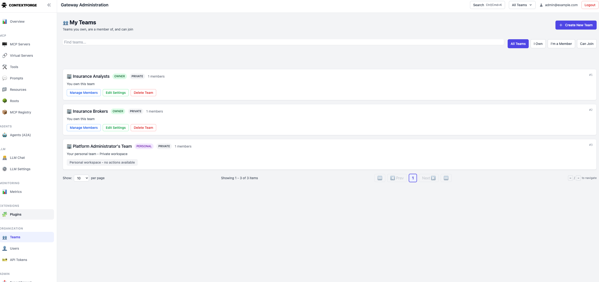
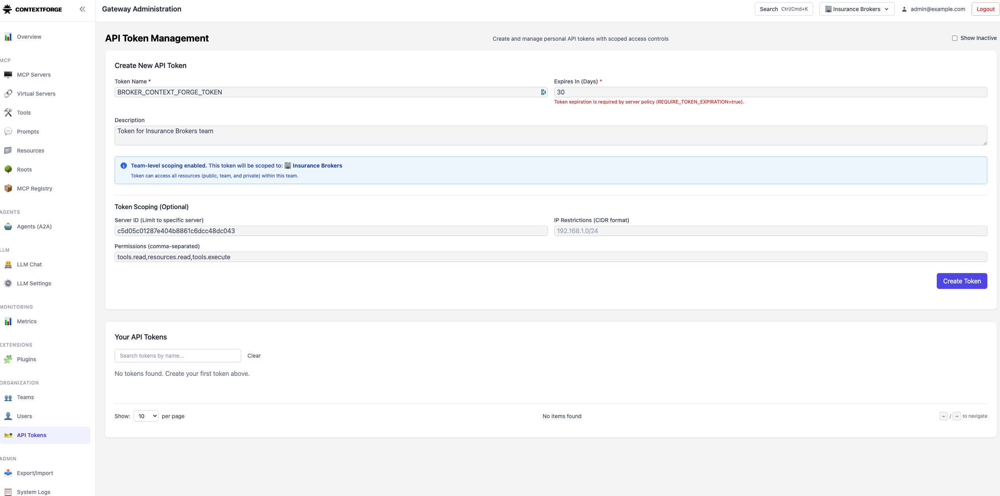
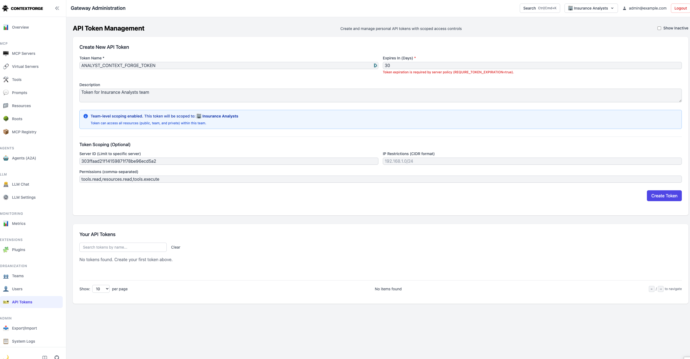
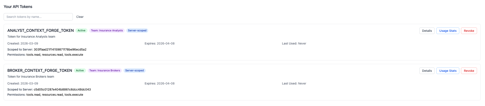

# Setup Guide — Context Forge Demo

This guide walks you through setting up the Context Forge Demo from scratch, from building Docker images to running the full agentic insurance workflow with role-based access control.

---

## Table of Contents

1. [Prerequisites](#1-prerequisites)
2. [Clone & Configure Environment](#2-clone--configure-environment)
3. [Build Docker Images](#3-build-docker-images)
4. [Start the MCP Servers](#4-start-the-mcp-servers)
5. [Verify MCP Servers with MCP Inspector](#5-verify-mcp-servers-with-mcp-inspector)
6. [Start Context Forge Infrastructure](#6-start-context-forge-infrastructure)
7. [Run the Setup Script](#7-run-the-setup-script)
8. [Log Into the Context Forge Admin UI](#8-log-into-the-context-forge-admin-ui)
9. [Change the Default Password](#9-change-the-default-password)
10. [Review the Resource Inventory](#10-review-the-resource-inventory)
11. [Create Team Tokens](#11-create-team-tokens)
12. [Update Your Environment File](#12-update-your-environment-file)
13. [Start the Agent Assist Application](#13-start-the-agent-assist-application)
14. [Run the Demo](#14-run-the-demo)

---

## 1. Prerequisites

Before you begin, make sure the following are installed and running on your machine:

| Requirement | Notes |
|---|---|
| [Docker](https://docs.docker.com/get-docker/) + Docker Compose | Docker Desktop recommended |
| `make` | Available by default on macOS/Linux |
| Node.js + `npx` | Required for the MCP Inspector |
| IBM WatsonX API access | `WATSONX_APIKEY` and `WATSONX_PROJECT_ID` |

---

## 2. Clone & Configure Environment

```bash
git clone <repo-url>
cd context-forge-demo
```

Copy the example environment file and fill in the required values:

```bash
cp .env.example .env
```

Open `.env` and set at minimum:

```bash
# IBM WatsonX — required
WATSONX_APIKEY=<your-api-key>
WATSONX_PROJECT_ID=<your-project-id>

# Container registry — used when building and pulling images
REPOSITORY=<your-registry>           # e.g. us.icr.io/your-repo-name
```

> **Context Forge settings** are in a separate file: `.env.contextforge`. This controls the gateway container (default port `4444`). The file ships with safe defaults — you only need to update `CONTEXT_FORGE_ADMIN_PASSWORD` after the first login (see [Step 9](#9-change-the-default-password)).

---

## 3. Build Docker Images

Build the base image first, then the agent-assist application image:

```bash
# Build the Python base image (shared layer)
make build-base

# Build the agent-assist application image
make build-agent-assist
```

> The MCP servers use a separate image. Build it only if you modified the MCP server code:
> ```bash
> make build-mcp-server
> ```

---

## 4. Start the MCP Servers

```bash
make run-mcp-server
```

This starts three containers in detached mode:

| Container | Port | Purpose |
|---|---|---|
| `underwriting_mcp_server` | 8007 | Underwriting guidelines via vector DB (Chroma) |
| `crm_mcp_server` | 8008 | Customer profiles and address management |
| `health_mcp_server` | 8009 | Medical conditions and smoking status |

### Verify the Underwriting server is ready

The `underwriting_mcp_server` ingests two PDF manuals into Chroma on first start. Wait for both ingestion messages before proceeding:

```bash
docker logs -f $(docker ps -aqf "name=context-forge-demo-underwriting_mcp_server-1")
```

Look for:

```
Ingestion complete. Collection 'BESAFE'
Ingestion complete. Collection 'MOONLIFE'
```

Once you see both lines, the server is ready.

---

## 5. Verify MCP Servers with MCP Inspector

Use the [MCP Inspector](https://github.com/modelcontextprotocol/inspector) to interactively verify each server is exposing its tools correctly:


```bash
npx @modelcontextprotocol/inspector
```

Connect to each server in turn:

- `http://localhost:8007/mcp` — Underwriting
- `http://localhost:8008/mcp` — CRM
- `http://localhost:8009/mcp` — Health



---

## 6. Start Context Forge Infrastructure

```bash
make run-infra
```

This starts two services:

- **Redis** — used as the Context Forge backend store
- **Context Forge Gateway** — the MCP control plane, available at `http://localhost:4444`

Wait a few seconds for the gateway container to become healthy before proceeding.

---

## 7. Run the Setup Script

```bash
make setup-context-forge
```

This script connects to the running Context Forge gateway and automatically:

1. Registers the three upstream MCP servers
2. Creates two teams: **Insurance Brokers** and **Insurance Analysts**
3. Provisions one team-scoped virtual server per team with the correct tool subset

**Registered MCP servers:**

| Name | Internal URL | Description |
|---|---|---|
| `underwriting` | `http://underwriting_mcp_server:8007/mcp` | Life insurance underwriting manuals |
| `crm` | `http://crm_mcp_server:8008/mcp` | Customer profiles and services |
| `health` | `http://health_mcp_server:8009/mcp` | Medical reports and conditions |

**Provisioned virtual servers:**

| Virtual Server | Team | Tools Exposed |
|---|---|---|
| `broker_gateway` | Insurance Brokers | `crm-get-client-id`, `crm-fetch-client-profile`, `underwriting-check-underwriting-guidelines`, `health-get-medical-condition` |
| `analysts_gateway` | Insurance Analysts | `crm-get-client-id`, `crm-fetch-client-profile`, `crm-update-address` |

When the script finishes, confirm you see:

```
setup-context-forge completed.
```

The script prints the virtual server IDs — copy them now, you will need them in [Step 12](#12-update-your-environment-file):

```bash
BROKER_CONTEXT_FORGE_VSERVER=<broker-virtual-server-id>
ANALYST_CONTEXT_FORGE_VSERVER=<analyst-virtual-server-id>
```

---

## 8. Log Into the Context Forge Admin UI

Open your browser and navigate to:

```
http://localhost:4444/admin/login
```

Default credentials (from `.env.contextforge`):

| Field | Default value |
|---|---|
| Email | `admin@example.com` |
| Password | `changeme` |



---

## 9. Change the Default Password

Immediately after logging in, change the default password:

**Settings → Change Password**



Then update your `.env.contextforge` file to match:

```bash
CONTEXT_FORGE_ADMIN_PASSWORD=<your-new-password>
```

---

## 10. Review the Resource Inventory

After setup, the Context Forge gateway should display:

- **3 MCP servers** registered
- **37 tools** registered
- **2 Teams** (Insurance Brokers, Insurance Analysts)
- **2 Virtual servers** (broker_gateway, analysts_gateway)
- **1 Plugin** enabled (PII filter)



You can also inspect the teams directly to confirm each virtual server is scoped to the correct set of tools:



---

## 11. Create Team Tokens

Each team needs a dedicated API token. Tokens control which virtual server an agent can access and what operations it can perform.

Navigate to **Teams** in the admin UI and create one token per team.

### Token for Insurance Brokers

Select the **Insurance Brokers** team, then create a token with:

| Field | Value |
|---|---|
| Name | `BROKER_CONTEXT_FORGE_TOKEN` |
| Virtual server | `<value of BROKER_CONTEXT_FORGE_VSERVER>` |
| Scopes | `tools.read, resources.read, tools.execute` |
| Comment | Token for Insurance Brokers team |



### Token for Insurance Analysts

Select the **Insurance Analysts** team, then create a token with:

| Field | Value |
|---|---|
| Name | `ANALYST_CONTEXT_FORGE_TOKEN` |
| Virtual server | `<value of ANALYST_CONTEXT_FORGE_VSERVER>` |
| Scopes | `tools.read, resources.read, tools.execute` |
| Comment | Token for Insurance Analysts team |



### Review the Token Inventory

Confirm both tokens appear in the token list before proceeding.



---

## 12. Update Your Environment File

Add all four values to your `.env` file:

```bash
# Context Forge — virtual server IDs (printed by make setup-context-forge)
BROKER_CONTEXT_FORGE_VSERVER=<broker-virtual-server-id>
ANALYST_CONTEXT_FORGE_VSERVER=<analyst-virtual-server-id>

# Context Forge — team-scoped tokens (created in Step 11)
BROKER_CONTEXT_FORGE_TOKEN=<token-scoped-to-Insurance-Brokers-team>
ANALYST_CONTEXT_FORGE_TOKEN=<token-scoped-to-Insurance-Analysts-team>
```

The agent-assist application reads these at startup to route each user role to the correct virtual server.

---

## 13. Start the Agent Assist Application

```bash
make run-agent-assist
```

Wait until the `agent-assist` container reports `(healthy)`:

```bash
docker ps --filter "name=agent-assist"
```

The application is available at **http://localhost:8002**.

---

## 14. Run the Demo

Open **http://localhost:8002** in your browser. The UI exposes three workflows selectable from a dropdown:

| Workflow | Description |
|---|---|
| Self-Serve QA | Customer-facing assistant answering underwriting questions in plain language |
| Agent Assist QA | Broker-facing RAG pipeline with technical citations |
| Agent Assist Agentic | Fully agentic ReAct workflow — demonstrates the impact of Context Forge |

### Scenario 1 — Direct connection (without Context Forge)

Select **Agent Assist Agentic** and set the connection mode to **Direct MCP**. The agent connects to all three MCP servers simultaneously with no scoping.

Run the following query as the **Broker** persona:

> *Would Lea Kim be eligible for life insurance considering her medical condition?*

Observe the agent's trajectory: it could hesitate between tools, query resources outside its intended scope, and produce a longer, less focused response.

### Scenario 2 — With Context Forge

Switch the connection mode to **Context Forge**. Each persona now connects through its own virtual server.

**Broker persona → broker_gateway**

> *Would Lea Kim be eligible for life insurance considering her medical condition?*

The agent calls only the four authorized tools in the correct order: CRM lookup → medical condition → underwriting guidelines. The trajectory is short and precise.

**Analyst persona → analysts_gateway**

> *Update Lea Kim's address to 1, Place Ville-Marie, Apt 2200, Montréal, Québec, H3B 2C1*

The analyst agent executes the CRM address update successfully. Health and underwriting tools are not visible — they do not exist in the analyst's virtual server.


---

## Stopping the Stack

```bash
make stop-containers
```

This stops and removes all running containers and volumes.

---

## Troubleshooting

| Symptom | Solution |
|---|---|
| `underwriting_mcp_server` never becomes ready | Check logs for PDF ingestion errors. Ensure the PDF files are present in `data/`. |
| `make setup-context-forge` fails with auth errors | Verify `CONTEXT_FORGE_TOKEN` is set in `.env` and the gateway is running at `http://localhost:4444`. |
| Agent-assist returns no tools | Confirm `BROKER_CONTEXT_FORGE_VSERVER`, `ANALYST_CONTEXT_FORGE_VSERVER`, and the two tokens are populated in `.env`, then restart with `make run-agent-assist`. |
| Port conflict on 4444 / 8007–8009 | Stop any conflicting process or update the port mappings in `docker-compose.yml` and `.env`. |
